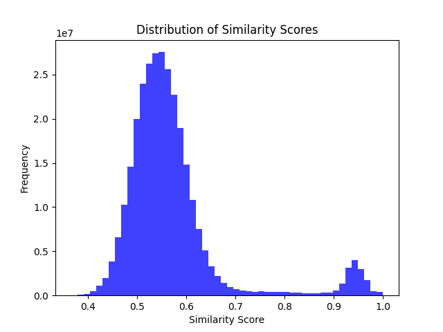

# NLP-duplicateJob


# **Job Posting Deduplication using NLP & Vector Search**  

## **Overview**  
This project detects duplicate job postings using **text embeddings** and **vector search**. It processes job descriptions, generates embeddings, and applies **approximate nearest neighbor (ANN) search** to identify similar job listings efficiently.  

## **Tech Stack**  
- **Python** (pandas, numpy, sentence-transformers)  
- **FAISS** (for vector search)  
- **Docker & Docker Compose**  
- **Jupyter Notebook** (for EDA)  

---

## **1. Setup Instructions**  

### **Install Dependencies**  
Using pip:  
```bash
pip install -r requirements.txt
```

Alternatively, using a virtual environment:  
```bash
python -m venv venv
source venv/bin/activate 
pip install -r requirements.txt
```

### **Run with Docker**  
Build and run the containerized app:  
```bash
docker-compose up --build
```

---

## **2. Data Exploration**  
I analyze the job postings dataset (`jobs.csv`), checking:  
- Basic info
- Missing values  
- Distribution of job titles
- Top companies with most job postings
- Length of job descriptions
- Top Job Titles with Duplicated Job Postings
- Top Companies with Duplicated Job Postings
- Job titles for Top Duplicated Job Descriptions for company Thriveworks (the company with highest Duplicated Job Postings)
- Job titles for Top Duplicated Job Descriptions for company LocumJobsOnline (the company with 2nd highest Duplicated Job Postings)

🔹 **Key Observations:**  
- Many job descriptions are exactly the same.
- The highest frequency is almost 600.  
- One company has as high as about 1400 duplicated job postings.  

Full analysis is in [`eda/EDA.ipynb`](eda/EDA.ipynb).  

---

## **3. Embeddings Generation**  
I use **Sentence-Transformers (SBERT)** to convert job descriptions into embeddings.  
- It provides pre-trained models with high quality embeddings
- Easy to use
- Works well for semantic similarity tasks  

---

## **4. Vector Search Implementation**  
I use **FAISS** for efficient similarity search.  
- Training is not necessary
- Supports Batch search
  
---

## **5. Evaluation**  
To determine duplicate postings, I calculated the similarity score based on the distance from vector search and set a threshold:  
- If **similarity > 0.85**, jobs are considered duplicates.  
- Threshold chosen based on histogram analysis.  
- If there is more time, I will analyze the similarity of the job titles with the same job description got from EDA, and make adjustment to the threshold. 



📊 **Results, only listing 20 as example:**  
job_id_1| job_id_2| similarity_score
| 1| 25696| 0.961661   |
| 1| 35280| 0.93402946   |
| 1| 89349| 0.93402946   |
| 1| 99534| 0.91176677   |
| 1| 58288| 0.9073727   |
| 1| 74039| 0.9073727   |
| 1| 97592| 0.9073727   |
| 2| 95310| 0.9902125   |
| 2| 1167| 0.9900367   |
| 2| 20465| 0.9898991   |
| 2| 40084| 0.988677   |
| 2| 10142| 0.9881144   |
| 2| 29573| 0.9880569   |
| 2| 58630| 0.98795766   |
| 2| 85205| 0.987644   |
| 2| 57945| 0.9875496   |
| 2| 511| 0.98746455   |
| 2| 1054| 0.9870129   |
| 2| 68233| 0.98689437   |
---

## **6. Running the Application**  

### **Step 1: Prepare Data & Generate Embeddings & Get Vector Search Index**  
```bash
python src/get_embeddings.py
```

### **Step 2: Run Vector Search and Calculate Similarity and duplication **  
```bash
python src/main.py
```
